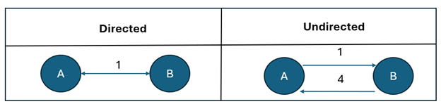

# Report
Fill out these report questions. 


1. What is the difference between a directed and undirected graph?
   
The difference between a directed and an undirected graph relates to how edges connect to vertices. In an undirected graph, edges from our source to sink vertices are always bidirectional with the same weight in either direction. In a directed graph, edges from source to sink can have different weights or may be unidirectional. The image below outlines these differences.


<p align="center">

</p>


2. What is the Big O of Dijkstra's algorithm.... 
   * Assuming you used an array (or list) to store the vertices.

        Using an array is slower for Dijkstra’s algorithm. For this implementation, we will have to check each vertex, $O(V)$, and when we visit each vertex, we will have to update every vertex’s neighbors, $O(V)$. Combining these results, we come to a runtime of $O(V^2)$.[3]

   * Assuming you used a heap / priority queue to store the vertices.

        The runtime for Dijkstra’s algorithm using a heap is $O((V+E)Log(V))$ where $V$ represents vertices and $E$ represents edges. This comes from combining two operations: extracting the min value and inserting a new value. With a heap, we can extract the min value in $O(V\log(V))$. To insert a value, this can be accomplished in $O(E\log(V))$. Combining these two results effectively makes it $O((V+E)Log(V))$.[3]


3. Explain in your own words what that means for larger graphs when trying to find the shortest distance.

    For shorter graphs, the difference between the implementations will be minuscule, but as the graph grows, the difference between the two algorithms will become more apparent. This is because the $n^2$ runtime grows much quicker than an $O(n\log(n))$ runtime. Looking at the log factor, as $O(V+E\log(V))$ tends towards infinity, the factor $\log(V)$ becomes smaller, which decreases the rate of growth. On the other hand, as $V^2$ tends toward infinity, the growth rate increases exponentially. Therefore $O(V+E\log(V))$ is a significantly better runtime then  $O(V^2)$.

## Deeper Thinking
4. For this assignment, you didn't need the most "efficient" set of data structures (for example, a heap wasn't required). However, think on the scale of google/apple maps - they have to deal with millions of vertices and edges. What data structures would you use to store the graph? Why? Somethings to consider - would you be able to store the entire graph at a time? Could you break it up into smaller pieces? How would you do that? Would there be advantages to caching/memoization of paths? You are free to explore your thoughts on this subject/reflect on various ideas. Other than a realization of some scalability of problems, there isn't a wrong answer. 
<br>
    <p align="center">
    
    </p>
    [4]
    There are probably several algorithms and data structures behind the scenes of Google Maps. This problem contains a lot of data to process, and therefore, we have to break it into manageable pieces.  Several sources say that Google uses quad trees as spatial indices. A quad tree decomposes 2d spatial information recursively into four quadrant regions. Looking at the image above, we see that a quad tree divides each region into sets of four sub-regions [4].
    <br><br>
    Using a quad tree, I imagine that Google dynamically and recursively solves there route or shortest path problem .  Let’s say we have metadata that outlines the average distance or time between sibling nodes in our quadtree. Using this information, we perform a shortest path problem and then recursively select the winning node. Of course, one issue with this, similar to the KD-ball tree algorithm, is that vertices in separate quadrants may never be considered as a viable path. After recursively performing Dykstra’s  algorithm, we will eventually be at the leaf level which will contain all our candidate roads. With this final selection of candidate roads, we could then solve Dykstra’s shortest path.
    <br><br>
    Dijkstra’s and A* are probably not the only shortest path algorithms used since we cannot have constraints over these shortest paths. Linear Optimization could also be used when users select various options like making multiple stops, low-mileage, and so on. These options would essentially be constraints in a linear optimization problem. I also suspect that memoization is used to queue up commonly used roads like highways and other paths. 


## Future Understanding
5. Related to shortest distance, is a problem called the "messenger" or "traveling sales person" problem commonly abbreviated to TSP. This problem is to find the shortest path that visits **every** vertex in a graph. Another way to look at it, is you are an delivery driver, and you have a series of packages to deliver. Can you find an optimal path for your deliveries that minimizes the total distance traveled? Imagine if you had 5 stops. How many different paths are there?  There are 120 possible paths to look at! (assuming fully connected routes). 
   * How many possible paths are there if you have 6 stops?
     * $n! = 6! = 720$
   * How many possible paths are there if you have 10 stops?
     * $n! = 10! = 3,628,800$
6. What type of growth is this problem?

    This is considered factorial growth, which is one of the worst types of growth. Essentially, every node is connected to every other node, and we need to consider all these paths in every conceivable order.

7. Take some time to research TSP problems. It falls under a certain classification of problems? What is it?
   
    The traveling salesman problem is an NP-hard problem. This means that the computational complexity of this problem is at least as hard as the hardest NP problems, and these problems take a long time to verify the correct answers. Essentially, this is the hardest class of problems in computer science.[2]
   
8. Provide some examples of fields / problems that use TSP.

    * Delivery Optimization: This is probably the quintessential example of a TSP problem. How can a delivery driver make the shortest possible delivery time while visiting each customer?
    * DNA Sequencing: In this problem, we try to connect fragments of DNA together.
    * Astronomy: We minimize the traversal time of a telescope by routing the “things to look at” into an optmized path.


> [!TIP]
> We are having you explore TSP, so you can see the terms used for problem classification that are often the foundation of computer science theory. You will not be asked to know about TSP outside of this assignment or even problem classification. Computer Science is often about dealing with problems considered "too hard" or "impossible", and finding ways to make them possible! As such, knowing topics such as N, NP, NP-Complete, etc. is important to understand the limits (to break).


## Technical Interview Practice Questions
For both these questions, are you are free to use what you did as the last section on the team activities/answered as a group, or you can use a different question.

1. Select one technical interview question (this module or previous) from the [technical interview list](https://github.com/CS5008-khoury/Resources/blob/main/TechInterviewQuestions.md) below and answer it in a few sentences. You can use any resource you like to answer the question.
   
    __Explain the concept of a greedy algorithm. When would you want to apply one?__

    A greedy algorithm makes the local “optimal” choice at each step to find the global optimal solution. A greedy algorithm should be applied to a problem where the local optimal choices lead to a global optimal solution. For example, logistic regression uses the Log Loss function, which has a convex cost curve. This means that as we traverse that cost curve, we are guaranteed to eventually arrive at the global optimum.

    This type of problem, local optimum leading to global optimum, is the ideal scenario for a greedy algorithm, but in practice, we often use greedy algorithms because we have no other viable options. For example, neural networks do not have a smooth cost curve; thus, they are not ideal for a greedy approach. Neural networks still use the greedy approach because there are no other viable options. Therefore, when we train a neural network, we are never guaranteed to have the best-performing algorithm.

<br>

3. Select one coding question (this module or previous) from the [coding practice repository](https://github.com/CS5008-khoury/Resources/blob/main/LeetCodePractice.md) and include a c file with that code with your submission. Make sure to add comments on what you learned, and if you compared your solution with others.

    __You have a long flowerbed in which some of the plots are planted, and some are not. However, flowers cannot be planted in adjacent plots.__
    ```c
    bool canPlaceFlowers(int* flowerbed, int flowerbedSize, int n) {
        bool plantable = false;
        for(int k=0; k<flowerbedSize; k++){
            int has_flower = flowerbed[k];
            if (has_flower){
                plantable=false;
            }
            else {
                if(plantable){
                    n-=1;
                    plantable=false;
                }else{
                    plantable=true;
                }
            }
            if(n==0){
                return true;
            }
        }
        return false;
    }
    ```


Sources:


[1] Dolci , C., & Salvini, D. (n.d.). Quadtrees. http://www.gitta.info/SpatPartitio/en/html/RegDecomp_learningObject3.html 

[2] GeeksforGeeks. (2025, July 23). P, NP, CoNP, NP hard and NP complete: Complexity Classes. GeeksforGeeks. https://www.geeksforgeeks.org/dsa/types-of-complexity-classes-p-np-conp-np-hard-and-np-complete/ 

[3] Setty, V. (2024, September 13). Time complexity analysis of Dijkstra’s algorithm. Medium. https://medium.com/@vikramsetty169/time-complexity-of-dijkstras-algorithm-ed4a068e1633 

[4] Wikimedia Foundation. (2025, October 15). Travelling salesman problem. Wikipedia. https://en.wikipedia.org/wiki/Travelling_salesman_problem#:~:text=The%20TSP%20has%20several%20applications,areas%2C%20such%20as%20DNA%20sequencing. 

